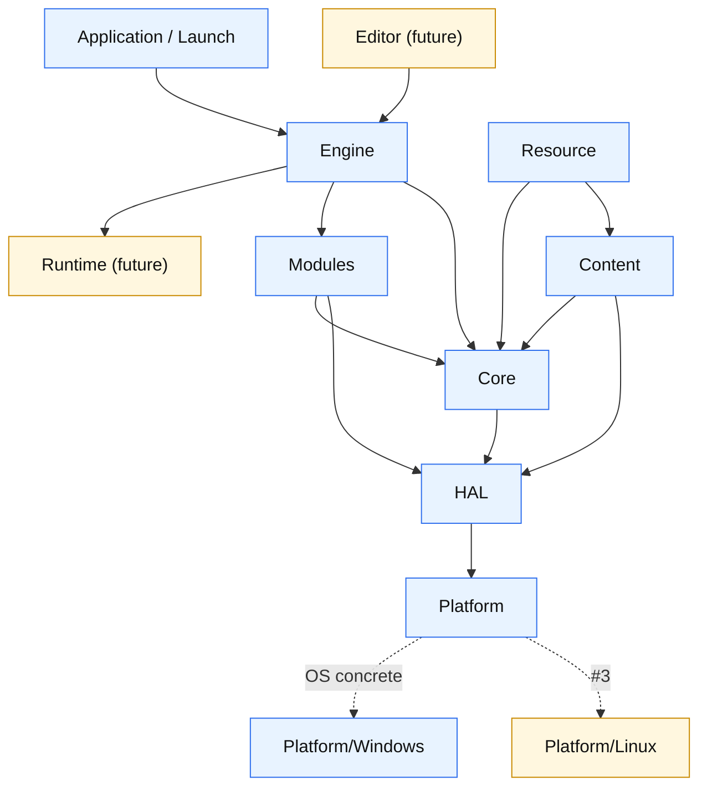
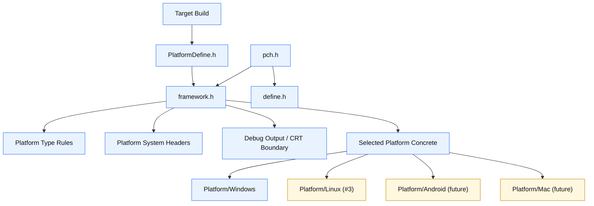
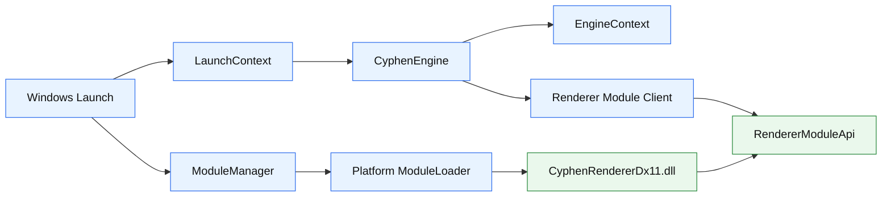
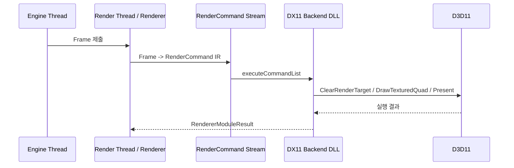
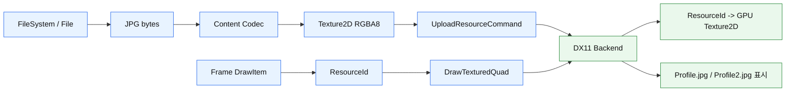
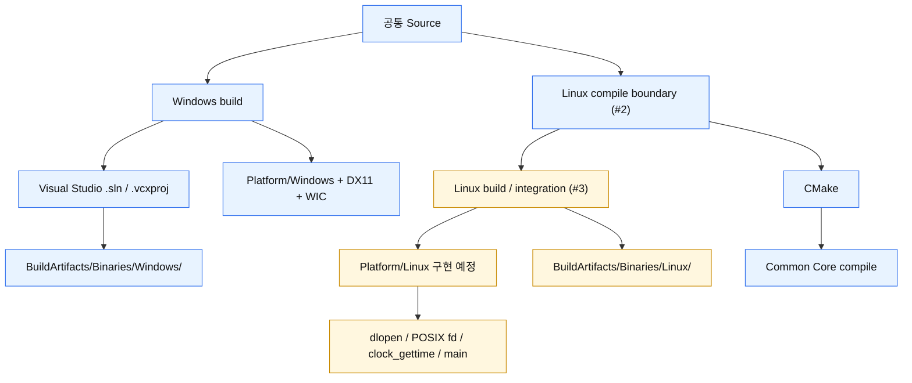
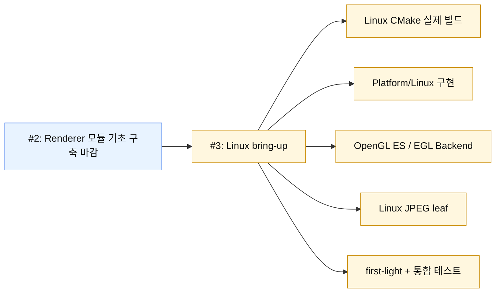

# CyphenEngine 구조 시각화

이 문서는 README의 현재 상태를 한눈에 보기 위한 구조 요약입니다. 세부 결정과 작업 이력은 `CyphenEngine/DevLog/`를 기준으로 관리합니다.

## 전체 계층 방향

- Core는 OS API를 직접 호출하지 않습니다.
- Platform은 OS 종속 구현을 담당합니다.
- HAL은 Core와 Platform 사이의 내부 계약입니다.
- Content는 파일 바이트를 엔진 중간 표현으로 해석합니다.
- ResourceManager는 아직 정식화하지 않았고, Resource / Texture2D 기초 타입과 debug upload 경로만 존재합니다.

## 빌드 타임 플랫폼 선택

- `PlatformDefine.h`는 빌드 타깃을 `PLATFORM_*`로 확정합니다.
- `framework.h`는 선택된 플랫폼 기준으로 시스템 헤더, OS 타입 규약, 디버그 출력 경계를 준비합니다.
- `pch.h`는 플랫폼 결정을 직접 수행하지 않고, `framework.h`와 공통 define을 묶는 진입점으로 둡니다.
- 빌드 시점에 이미 결정 가능한 플랫폼 차이는 런타임 인터페이스가 아니라 빌드 타임 concrete 선택으로 고정합니다.

## Renderer 모듈 기초 구조 (#2)

#2에서 닫은 범위는 Renderer 기능 전체 완성이 아니라, Renderer를 모듈로 분리하고 Backend DLL을 통해 실행할 수 있는 기초 구조입니다.

## Render Thread / Command Stream

- `Frame`은 렌더링할 월드 상태의 불변 스냅샷입니다.
- Renderer는 `Frame`을 `RenderCommand` IR로 변환합니다.
- Backend는 `RenderCommand` / `ResourceCommand`를 실제 그래픽 API 호출로 변환합니다.
- #2의 최소 표시 검증은 Clear / Present에서 시작해 Texture2D + TexturedQuad까지 확장됐습니다.

## Texture2D 업로드와 Debug 표시 경로

- `Frame`에는 대용량 픽셀 데이터를 싣지 않습니다.
- Texture2D는 업로드 시점에 GPU 리소스로 전환됩니다.
- 매 프레임 DrawItem은 GPU에 올라간 리소스를 `ResourceId`로 참조합니다.
- 현재 표시 경로는 정식 ResourceManager가 아니라 debug bootstrap bridge입니다.

## 빌드 / 플랫폼 경계

- Windows 프로덕션 빌드는 `.sln` / `.vcxproj`를 유지합니다.
- CMake는 Linux 빌드 전용 경로입니다.
- Windows에서의 CMake 빌드는 Linux 환경 없이 CMake 기술서를 확인하는 프록시 성격입니다.
- #2와 #3의 경계는 "Linux에서 컴파일된다"입니다.
- 실제 Linux 빌드, Platform/Linux 구현, Linux Renderer Backend, first-light, 통합 테스트는 #3에서 진행합니다.

## #3 시작점

#3의 목표는 #2에서 만든 Renderer 모듈 기초 위에서 실제 Linux 빌드와 표시 경로를 세우는 것입니다.
