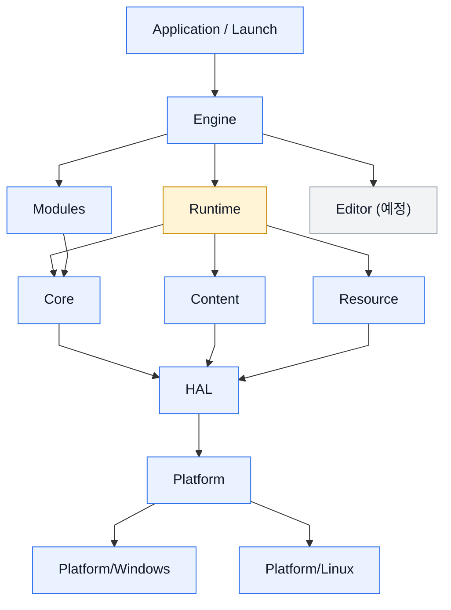
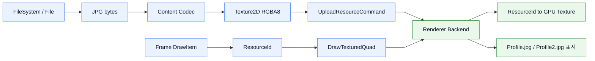
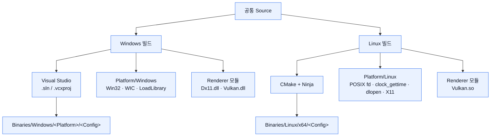
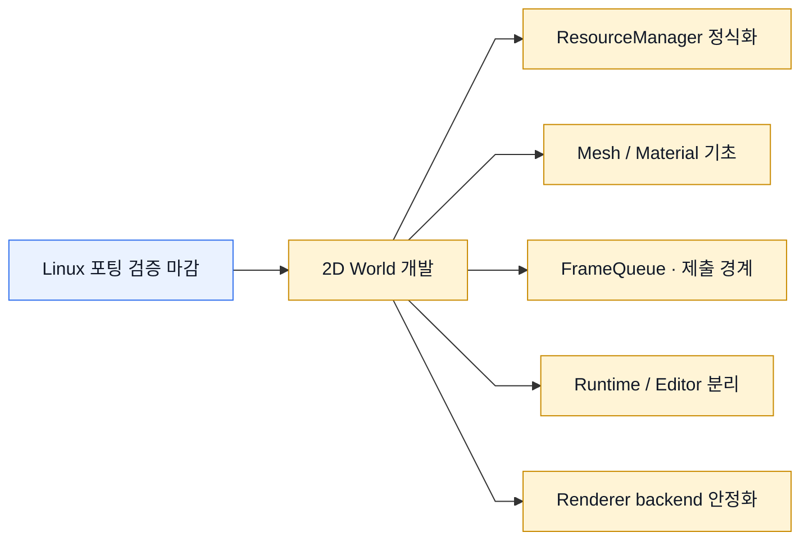

# CyphenEngine 구조 시각화

이 문서는 README에서 줄인 구조 설명을 보충하는 시각화 문서입니다.
세부 결정과 작업 이력은 `CyphenEngine/DevLog/`를 기준으로 관리합니다.

현재 main 기준은 #3 Linux 포팅 검증 이후 상태입니다.
Windows에서는 Dx11 / Vulkan backend를, Linux에서는 Vulkan backend를 같은 Renderer Module ABI 위에서 실행하는 데까지 확인했습니다.

> 색 규칙: 파란색 = 현재 구현 경로, 노란색 = 다음 단계(#4), 회색 = 예정.

## 전체 계층 방향

```mermaid
%%{init: {'flowchart': {'curve': 'linear'}}}%%
flowchart TB
    Launch["Application / Launch"] --> Engine["Engine"]
    Engine --> Runtime["Runtime"]
    Engine --> Modules["Modules"]
    Engine --> Editor["Editor (예정)"]
    Runtime --> Core["Core"]
    Runtime --> Content["Content"]
    Runtime --> Resource["Resource"]
    Modules --> Core
    Core --> HAL["HAL"]
    Content --> HAL
    Resource --> HAL
    HAL --> Platform["Platform"]
    Platform --> Windows["Platform/Windows"]
    Platform --> Linux["Platform/Linux"]

    classDef current fill:#eaf2ff,stroke:#2f6fed,color:#111827;
    classDef next fill:#fff4d6,stroke:#c98a00,color:#111827;
    classDef future fill:#f1f3f5,stroke:#9ca3af,color:#111827;
    class Launch,Engine,Modules,Core,Content,Resource,HAL,Platform,Windows,Linux current;
    class Runtime next;
    class Editor future;
```

- Core는 OS API를 직접 호출하지 않습니다.
- Platform은 OS 종속 구현을 담당합니다.
- HAL은 Core / Engine 내부 구현과 Platform 구현 사이의 내부 계약입니다.
- Content는 파일 바이트를 엔진 중간 표현으로 해석합니다.
- Resource는 CPU-side 리소스 표현을 관리하고, GPU resource 생성은 Renderer backend가 담당합니다.
- Runtime은 #4에서 2D 월드 표시 흐름을 올리며 구체화할 대상입니다.
- 현재 Runtime은 ObjectManager, Object 종속 수명, WorldObject Join/Leave와 GameRuntime / World 실행 단계 경계를 포함합니다.
- Update Scheduler와 System enroll 실행 기계는 다음 Runtime 확장 대상입니다.

## 플랫폼 / 렌더러 모듈 배치

- Engine 상위 흐름은 backend 종류를 직접 알지 않습니다.
- Windows에서는 Dx11과 Vulkan module을 모두 로드할 수 있습니다.
- Linux에서는 `CyphenRendererVulkan.so`를 로드해 X11 window 위에 Vulkan surface를 생성합니다.
- Vulkan renderer 내부 흐름은 공유하고, surface 생성만 Win32 / Xlib으로 갈라집니다.

## Render Loop / Backend 실행

- Engine은 매 프레임 표시할 상태를 `Frame`으로 제출합니다.
- Renderer는 `Frame`을 `RenderCommand` / `ResourceCommand`로 변환합니다.
- Backend는 command stream을 순차 파싱하고 command type별 handler로 디스패치합니다.
- Draw command는 `ResourceId`로 GPU resource table을 조회하고, pipeline을 통해 textured quad를 그립니다.
- Present 완료는 다음 프레임으로 넘어가는 tick-lock 기준이 됩니다.

## Texture2D 업로드와 Debug 표시 경로

```mermaid
%%{init: {'flowchart': {'curve': 'linear'}}}%%
flowchart LR
    FileSystem["FileSystem / File"] --> Bytes["JPG bytes"]
    Bytes --> Codec["Content Codec"]
    Codec --> Texture2D["Texture2D RGBA8"]
    Texture2D --> ResourceCommand["UploadResourceCommand"]
    ResourceCommand --> Backend["Renderer Backend"]
    Backend --> TextureTable["ResourceId to GPU Texture"]
    Frame["Frame DrawItem"] --> ResourceId["ResourceId"]
    ResourceId --> RenderCommand["DrawTexturedQuad"]
    RenderCommand --> Backend
    Backend --> Screen["Profile.jpg / Profile2.jpg 표시"]

    classDef data fill:#eaf2ff,stroke:#2f6fed,color:#111827;
    classDef gpu fill:#eaf8ec,stroke:#2b8a3e,color:#111827;
    class FileSystem,Bytes,Codec,Texture2D,ResourceCommand,Frame,ResourceId,RenderCommand data;
    class Backend,TextureTable,Screen gpu;
```

- `Frame`에는 대용량 픽셀 데이터를 싣지 않습니다.
- Texture2D는 upload command를 통해 backend의 GPU resource table로 올라갑니다.
- 매 프레임 DrawItem은 GPU에 올라간 리소스를 `ResourceId`로 참조합니다.
- 현재 표시 경로는 정식 ResourceManager가 아니라 debug bootstrap bridge입니다.

## 빌드 / 플랫폼 경계

```mermaid
%%{init: {'flowchart': {'curve': 'linear'}}}%%
flowchart TB
    Source["공통 Source"] --> WindowsBuild["Windows 빌드"]
    Source --> LinuxBuild["Linux 빌드"]

    WindowsBuild --> VS["Visual Studio<br/>.sln / .vcxproj"]
    WindowsBuild --> WinLeaf["Platform/Windows<br/>Win32 · WIC · LoadLibrary"]
    WindowsBuild --> WinRenderer["Renderer 모듈<br/>Dx11.dll · Vulkan.dll"]
    VS --> WinBin["Binaries/Windows/&lt;Platform&gt;/&lt;Config&gt;"]

    LinuxBuild --> CMake["CMake + Ninja"]
    LinuxBuild --> LinuxLeaf["Platform/Linux<br/>POSIX fd · clock_gettime · dlopen · X11"]
    LinuxBuild --> LinuxRenderer["Renderer 모듈<br/>Vulkan.so"]
    CMake --> LinuxBin["Binaries/Linux/x64/&lt;Config&gt;"]

    classDef current fill:#eaf2ff,stroke:#2f6fed,color:#111827;
    class Source,WindowsBuild,LinuxBuild,VS,CMake,WinLeaf,LinuxLeaf,WinRenderer,LinuxRenderer,WinBin,LinuxBin current;
```

- Windows 프로덕션 빌드는 `.sln` / `.vcxproj`를 유지합니다.
- Linux 빌드는 CMake + Ninja 전용 경로로 운용합니다.
- Linux main 기준으로 `CyphenEngine`, `CyphenRendererVulkan.so`, SPIR-V shader 산출물을 같은 출력 경로에 배치합니다.
- module export 규칙은 Windows `__declspec(dllexport)`와 Linux `visibility default`를 공통 매크로 뒤에서 갈라 처리합니다.

## #4 진입점

```mermaid
%%{init: {'flowchart': {'curve': 'linear'}}}%%
flowchart LR
    Close3["Linux 포팅 검증 마감"] --> Start4["2D World 개발"]
    Start4 --> ResourceManager["ResourceManager 정식화"]
    Start4 --> MeshMaterial["Mesh / Material 기초"]
    Start4 --> FrameQueue["FrameQueue · 제출 경계"]
    Start4 --> RuntimeEditor["Runtime / Editor 분리"]
    Start4 --> RendererStable["Renderer backend 안정화"]

    classDef done fill:#eaf2ff,stroke:#2f6fed,color:#111827;
    classDef next fill:#fff4d6,stroke:#c98a00,color:#111827;
    class Close3 done;
    class Start4,ResourceManager,MeshMaterial,FrameQueue,RuntimeEditor,RendererStable next;
```

#3(Linux 포팅 검증)을 마감하고 #4로 진입합니다.
#4의 목표는 debug fixture로 확인한 Texture2D 표시 경로 위에 실제 2D 월드 표시 흐름을 올리는 것입니다.
