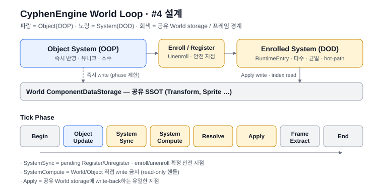
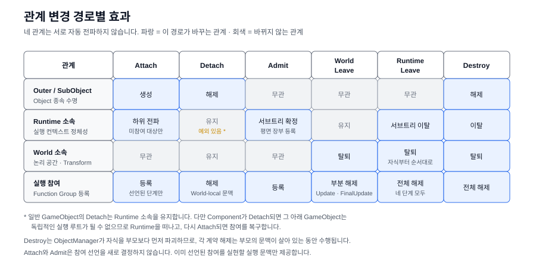
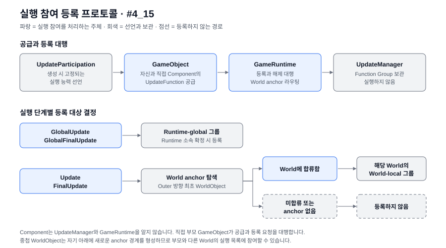
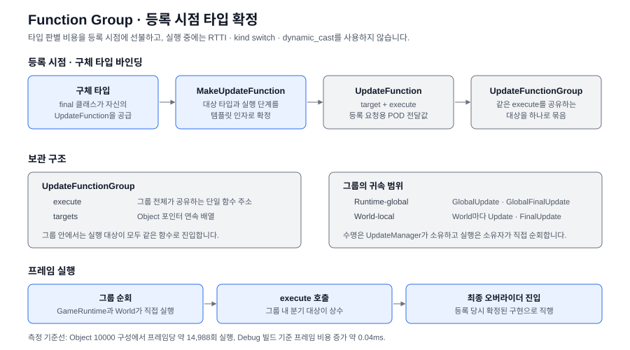

# CyphenEngine World Loop (#4 실행 경계)

이 문서는 #4 2D 월드의 현재 실행 경계와 후속 System 방향을 정리합니다. 엔진 전체 흐름은 [Architecture.md](Architecture.md), 규칙 원문은 `CyphenEngine/DevLog/Decisions.txt`의 `CyphenEngine_World_Loop_Rule`입니다.

> 파랑 = OOP 실행 경계 · 노랑 = System 실행 경계 · 회색 = World 소속과 공유 상태.

## 두 실행 체계의 병존

CyphenEngine World는 순수 ECS가 아닙니다. OOP Object를 기본 정의 표면으로 두고, 다수·균일·hot-path 행동만 런타임에 System으로 enroll해 DOD로 실행합니다.

현재 #4_15까지 구현된 것은 Object 수명, Runtime과 World 소속, World 생성·파괴, 상위 실행 단계의 경계, 그리고 UpdateManager의 실행 그룹 등록·해제입니다. 실행 우선순위 Scheduler와 System enroll 저장소는 아직 구현하지 않았습니다.



세 관계는 서로 자동 전파하지 않습니다.

- `Outer / SubObject`: Object의 종속 수명
- `World Join / Leave`: WorldObject의 논리 공간 소속과 Transform 정본
- `Update / System 참여`: UpdateManager가 관리하는 실행 관계

관계 변경은 실행 참여를 자동으로 결정하지 않습니다. 다만 Runtime 소속이 확정되는 경로(`Admit`, `Attach`, `Join`)에서 이미 선언된 참여를 실현하고, 이탈 경로(`Leave`, `Detach`, `Destroy`)에서 해제합니다.



## Runtime 다섯 단계

`GameRuntime::Tick`은 다음 순서를 고정합니다.

```
GlobalUpdate
ProcessBeforeWorldTicks
각 World Tick
ProcessAfterWorldTicks
GlobalFinalUpdate
```

`Global`은 프로세스 전역 싱글턴이 아니라 하나의 `GameRuntime`이 소유한 모든 World에 공통인 실행 범위입니다. `ProcessBeforeWorldTicks`와 `ProcessAfterWorldTicks`는 여러 World를 사이에 둔 Runtime-global System 처리 경계입니다.

GameRuntime은 World를 자동 생성하지 않으며 명시적으로 생성한 World를 0개 이상 소유합니다. 소유한 World 수와 관계없이 이 다섯 단계의 상위 순서는 유지합니다.

## World 세 단계

각 `World::Tick`은 다음 순서를 고정합니다.

```
Update
ProcessAll
FinalUpdate
```

- `Update`: World-local OOP 선행 실행 경계
- `ProcessAll`: World-local System 실행 경계
- `FinalUpdate`: World-local OOP 후행 실행 경계

`Update`와 `FinalUpdate`는 UpdateManager가 공급한 World-local Function Group을 순회합니다. 실행 순서 우선순위, 활성 상태 반영과 `ProcessAll` 내부의 세부 System phase는 실제 소비자가 생기는 후속 작업에서 추가합니다.

## 실행 참여 등록

`UpdateParticipation`은 실행 능력의 선언이고, `UpdateFunction`은 그 선언을 실행 그룹에 반영한 결과입니다. 둘은 같은 상태가 아닙니다.

GameRuntime마다 `UpdateManager` 하나가 Runtime-global 그룹과 각 World의 World-local 그룹 수명을 소유합니다. 실행은 UpdateManager가 하지 않습니다. GameRuntime과 World가 자신에게 귀속된 읽기 전용 그룹을 직접 순회합니다.



- Component는 UpdateManager를 알지 않습니다. 직접 부모 GameObject가 공급과 등록 요청을 대행합니다.
- 구체 타입이 자신의 `UpdateFunction`을 공급하므로 실행 대상의 최종 오버라이더는 등록 시점에 확정됩니다. 실행 중에는 RTTI, kind switch, `dynamic_cast`를 사용하지 않습니다.
- `GlobalUpdate` / `GlobalFinalUpdate`는 Runtime 소속이 확정되면 등록합니다.
- `Update` / `FinalUpdate`는 Outer 방향으로 만나는 최초 WorldObject를 World anchor로 사용하고, 그 anchor가 World에 합류한 경우에만 등록합니다. 중첩 WorldObject는 자기 아래에 새 anchor 경계를 형성합니다.
- 활성 상태는 현재 실행 게이트와 연결되어 있지 않습니다. 실행 함수는 `IsActive`를 확인하지 않으며, 활성 제어는 후속 ActivationPivot 정책에서 다룹니다.

## Function Group과 등록 시점 확정

타입 판별 비용은 등록 시점에 선불합니다. 구체 타입이 자신의 `UpdateFunction`을 공급하므로 실행 대상의 최종 오버라이더가 등록 시점에 확정되고, 같은 실행 함수를 공유하는 대상은 하나의 그룹으로 묶입니다. 그 결과 프레임 실행 경로에는 타입 판별이 남지 않고 그룹 내 분기 대상도 상수가 됩니다.



실측 기준선은 다음과 같습니다. 같은 장비의 같은 세션에서 커밋 시점을 옮겨 가며 측정했고, 실행 대상이 없는 상태를 baseline으로 삼았습니다.

```
Windows x64 Debug · 데스크톱 · 언캡 실행

baseline (#4_12, 실행 대상 없음)     0.092ms
Object 10000 · 프레임당 14,988회      0.167ms   (+0.075ms · 호출당 5.0ns)
```

`#4_1`부터 `#4_14`까지는 실행 대상이 없는 동안 프레임 비용이 baseline에서 변하지 않았습니다. Function Group 구조를 도입한 `#4_13` 시점에도 측정 가능한 상시 비용은 없었고, 비용은 등록된 실행 대상 수에만 비례했습니다.

같은 워크로드에서 구체 타입 공급을 제거하고 기반 클래스로 바인딩하면 실행 비용이 `+0.197ms`(호출당 13.1ns)로 늘어납니다. 그룹 하나에 여러 구체 타입이 섞이면서 실행 중 분기 대상이 상수가 아니게 되기 때문입니다. 등록 시점 타입 확정의 효과는 실행 비용 기준 약 2.6배입니다.

실행 우선순위 재구성은 UpdateManager가 아니라 후속 Scheduler의 책임입니다.

## Object와 World의 수명 경계

`ObjectManager`는 ObjectHandle 발급, 활성 Registry와 지연 파괴를 관리합니다. `Object`의 `Outer / SubObject`는 자식을 부모보다 먼저 파괴하기 위한 종속 수명 관계이며 World 소속이나 실행 순서를 뜻하지 않습니다.

`GameObject`는 직접 부착된 Component를 평면 목록으로 관리합니다. Component도 Object이므로 독립 ObjectHandle을 갖지만, GameObject composition에 참여할 때 직접 Outer는 GameObject여야 합니다. Component-in-Component는 허용하지 않습니다.

`WorldObject`는 생성 직후 Runtime과 World 어디에도 속하지 않을 수 있습니다. `GameRuntime::Admit`은 전달받은 서브트리에 포함된 모든 GameObject의 Runtime 소속을 평면 장부에 확정하고, `World::Join`은 WorldObject의 비소유 참조와 Transform 정본을 연결합니다. `World::Spawn`은 생성, Runtime Admit과 World Join을 합성하며 복제 API가 아닙니다.

`World::Leave`는 World 연결과 World-local 실행 참여만 제거하고 Runtime 소속은 유지합니다. `GameRuntime::Leave`는 서브트리가 각자의 World를 떠난 뒤 Runtime을 이탈시키며, 두 경우 모두 Object 자체를 파괴하지 않습니다.

Component 아래의 GameObject는 독립적인 Runtime 참여 루트가 될 수 없습니다. 따라서 Component가 Detach되면 그 아래 GameObject는 Runtime을 떠나고, 다시 Attach되면 참여를 복구합니다. 일반 GameObject의 Detach는 Runtime 소속을 유지합니다.

## Handle과 저장 위치

`Handle<Type>`은 관리 도메인 안의 타입 안전한 식별값입니다. `ObjectHandle`과 향후 `EntityHandle`은 서로 독립된 값 공간이며 내부 숫자의 일치로 관계를 추론하지 않습니다.

`StorageSlot<Type>`은 `ComponentDataStorage`의 `index + generation` 저장 위치입니다. Object 정체성과 Transform 저장 위치는 같은 Handle로 표현하지 않습니다.

현재 World storage의 확정 정본은 Join한 WorldObject의 Transform입니다. Sprite 등 다른 ComponentData의 소유 위치는 실제 소비 System이 생길 때 별도로 결정합니다.

## 후속 System 설계 기준

투사체처럼 다수·균일·hot-path인 대상은 다음 방향으로 System화합니다. 아래 이름과 세부 phase는 아직 구현 계약이 아닙니다.

```
OOP Object / Component
    Register 요청

안전 지점
    Enroll
    RuntimeEntry와 ComponentDataStorage 연결

System 실행
    연속 RuntimeEntry / ComponentData 범위 처리

안전 지점
    Unregister 요청 확정
    Unenroll
```

- Register / Unregister는 구조 변경 요청이고 Enroll / Unenroll은 안전 지점의 실제 구조 변경입니다.
- System hot loop는 Object Registry를 반복 조회하지 않고 연속 RuntimeEntry 또는 ComponentData 범위를 처리합니다.
- 여러 실행 주체가 공유하는 데이터는 복사본을 늘리기 전에 SSOT와 write ownership을 먼저 정합니다.
- SystemSync / Compute / Resolve / Apply 같은 세부 단계는 실제 System의 의존성과 데이터 흐름이 요구할 때 `ProcessAll` 안에서 확정합니다.

## #4_15 경계

GameObject의 Runtime Admit / Leave와 파괴 이탈, GameRuntime의 명시적 World 소유, WorldObject의 Join / Leave와 `World::Spawn` 합성 경로를 현재 수명·소속 경계로 고정합니다.

UpdateManager의 Function Group 등록·해제와 World anchor 기반 라우팅을 현재 실행 참여 경계로 고정합니다. 실행 우선순위 Scheduler, ActivationPivot 기반 활성 제어, 안전 지점 이벤트 큐와 FixedUpdate는 후속 구현합니다.

검증 기준선은 다음과 같습니다.

```
RuntimeTests            PASS=201 FAIL=0
참여 조합 실행 검증      16조합 x 3계열 = 48

최종 유지 상태
    Runtime 1 · World 3 · Object 10000
    WorldObject 2500 · 일반 GameObject 2500
    Component 2500 · 일반 Object 2500

프레임당 실행 횟수
    GlobalUpdate 3750 · GlobalFinalUpdate 3746
    Update 3748 · FinalUpdate 3744 (World 3개 합계)
```

Debug 계측 로그의 World 항목은 세 World의 합계가 아니라 마지막으로 Tick된 World의 값입니다.
