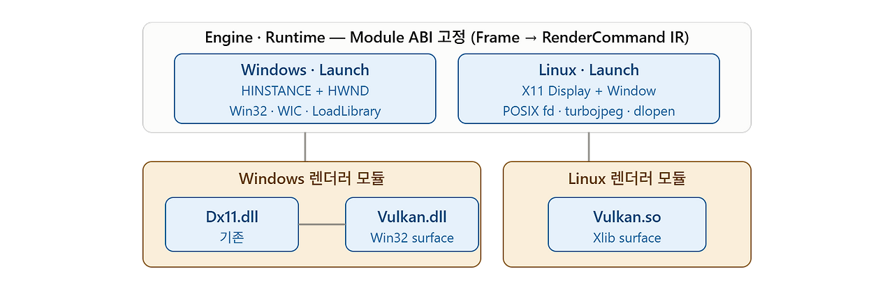
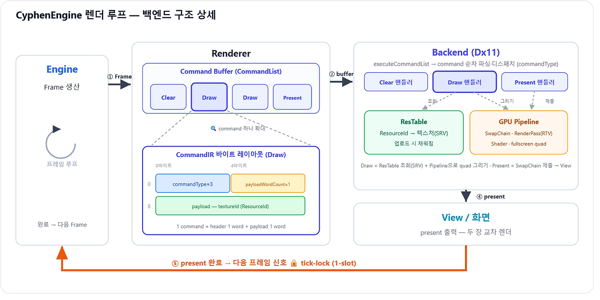

# CyphenEngine

CyphenEngine은 엔진의 핵심 책임을 직접 설계하고 검증하기 위한 개인 게임 엔진 프로젝트입니다.

거대한 범용 엔진을 복제하는 것이 목표가 아니라, **Data-Oriented Design**, **모듈식 구조**, **크로스플랫폼 실행 기반**을 실제 코드로 검증하는 데 초점을 둡니다.

## 한눈에 보는 구조

엔진 상위 흐름(`Frame → RenderCommand IR`)과 Module ABI는 고정입니다. Windows는 `Dx11.dll` / `Vulkan.dll`을, Linux는 `Vulkan.so`를 같은 ABI 위에서 로드합니다. Vulkan 렌더러 내부는 공유하고 surface 생성만 Win32 / Xlib으로 갈라집니다.

## 프로젝트 방향

CyphenEngine은 Unreal Engine처럼 엔진 중심의 저수준 제어와 명확한 계층 분리를 참고합니다. 다만 Unreal을 그대로 따라 만드는 프로젝트는 아닙니다.

핵심 관심사는 다음과 같습니다.

- 데이터 배치와 실행 비용을 고려하는 DOD 지향 설계
- Core / Platform / Engine / Runtime / Editor / Modules 계층 분리
- 빌드 타임에 결정 가능한 플랫폼 차이를 런타임 추상화로 끌고 오지 않는 구조
- Renderer를 Engine에 고정하지 않고 모듈 ABI를 통해 교체 가능한 backend로 연결하는 구조
- Windows와 Linux 양쪽에서 같은 엔진 상위 흐름을 유지하는 크로스플랫폼 기반

## 현재 상태

현재 main 브랜치는 #3 Linux 포팅 검증을 마치고 #4 2D 월드 개발 단계로 넘어간 상태입니다.

완료된 큰 흐름은 다음과 같습니다.

- Core I/O, Path, Time, FileSystem의 Platform 경계 분리
- Renderer Module ABI와 backend DLL / SO 로딩 구조 구축
- Dx11 renderer backend에서 Texture2D 업로드와 textured quad 표시 확인
- Vulkan renderer backend를 Windows에서 먼저 검증한 뒤 Linux `.so`로 연결
- WSL2 + X11 + Vulkan 환경에서 Linux GUI 창과 렌더링 경로 확인

현재 화면에 표시되는 것은 아직 debug fixture 수준의 텍스처 출력입니다. 하지만 Windows에서는 Dx11 / Vulkan backend를, Linux에서는 Vulkan backend를 같은 엔진 상위 흐름으로 실행하는 데까지 확인했습니다.

## 렌더 파이프라인

`Frame → Command Buffer → Backend 디스패치 → present` 흐름과 CommandIR 바이트 레이아웃을 나타냅니다. present 완료가 다음 프레임의 tick-lock 기준이 됩니다. 계층 구조·빌드 경계 등 나머지 다이어그램은 [Docs/Architecture.md](Docs/Architecture.md)에 있습니다.

## 기술 스택

- Language: C++17
- Windows: Visual Studio `.sln` / `.vcxproj`, Win32, Dx11, Vulkan
- Linux: WSL2, CMake, Ninja, X11, Vulkan
- Image decoding: WIC, libjpeg-turbo
- Build artifacts: `BuildArtifacts/Binaries/<OS>/<Config>/`

## 검증 기준

Debug 빌드 기준으로 다음 흐름을 확인합니다.

- Core I/O regression tests
- Module / Renderer Module ABI tests
- Windows Dx11 renderer backend 실행
- Windows Vulkan renderer backend 실행
- Linux Vulkan renderer backend + X11 GUI 실행

현재 main 기준 확인된 기준선은 다음과 같습니다.

- CoreIoTests: `PASS=69 / FAIL=0`
- ModuleTests: `PASS=34 / FAIL=0`
- Windows: `CyphenEngine` + `CyphenRendererDx11` / `CyphenRendererVulkan` 실행 확인
- Linux: `CyphenEngine` + `CyphenRendererVulkan.so` 빌드 및 GUI 실행 확인

## 문서

- [구조 시각화](Docs/Architecture.md): 계층 구조, Renderer Module ABI, Command Stream, 빌드 / 플랫폼 경계
- [World Loop 실행 구조](Docs/WorldLoop.md): #4 Object/System 병존·Tick Phase·Enroll/Register와 대표 예시
- `CyphenEngine/DevLog/`: 작업 단위별 개발 기록
- `CyphenEngine/DevLog/폴더 기능 정리.txt`: 폴더별 책임 요약
- `CyphenEngine/DevLog/Todos.txt`: 현재 작업 큐와 남은 설계 항목

README는 프로젝트 소개와 현재 방향만 다룹니다. 세부 구현 방식과 작업 이력은 위 문서에서 관리합니다.

## 다음 목표

#4의 목표는 2D 월드를 실제로 올릴 수 있는 기반을 만드는 것입니다.

- ResourceManager 정식화
- Mesh / Material 기초 구조 추가
- FrameQueue와 렌더 제출 경계 정리
- Runtime / Editor 책임 분리
- Windows / Linux 양쪽에서 유지 가능한 renderer 경계 보강
- World Loop 실행 구조 도입 — Object(OOP) + 런타임 enroll된 System(DOD) 병존 (설계 확정, 구현 예정)

## 개발 방식

- 작은 단위로 설계하고 검증합니다.
- 구현보다 책임 경계를 먼저 확인합니다.
- 트리거가 오기 전까지 계층을 앞당기지 않습니다.
- 자동화보다 실제 엔진 설계를 우선합니다.
- DevLog는 작업 흐름 단위로 핵심 결정만 압축해 남깁니다.
